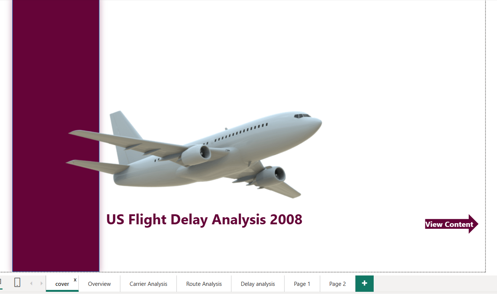
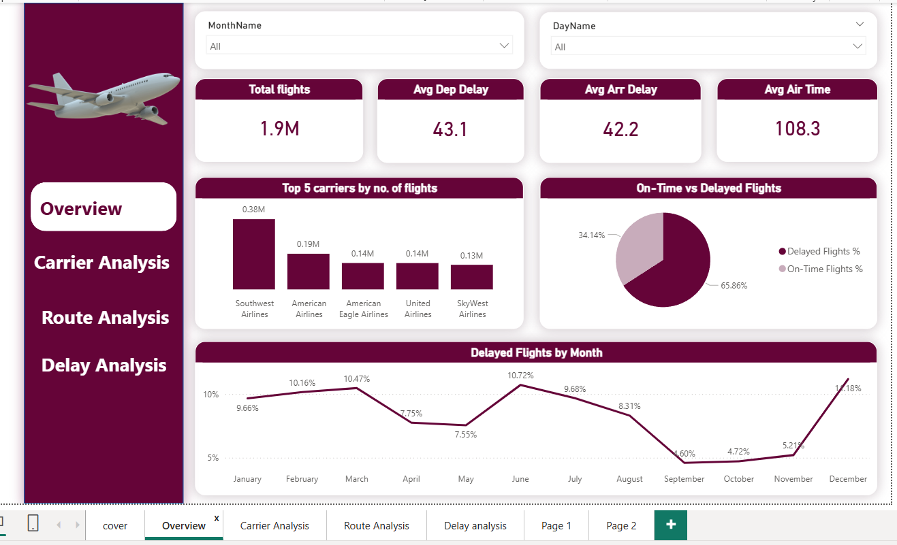

# ✈️ US Flight Delay Analytics & Performance Dashboard

## 📌 Project Overview
An end-to-end data analytics project focused on analyzing 2008 US flight operations to identify delay patterns, evaluate carrier performance, and uncover root causes of operational bottlenecks. 

The project spans the full analytics workflow: from data preprocessing and exploratory data analysis (EDA) to dimensional data modeling and interactive Power BI dashboard design.

---

## 🎯 Business & Analytical Objectives
- **Monitor Key Metrics:** Track overall flight volumes, delay percentages, and average departure/arrival delays.
- **Analyze Root Causes:** Categorize delay factors (Late Aircraft, Carrier, NAS, Weather, Security) to target operational inefficiencies.
- **Carrier & Route Benchmarking:** Compare airline reliability and highlight high-delay flight paths.
- **Temporal Trends:** Evaluate delay variations across months to pinpoint seasonal peaks.

---

## 🛠️ Tools & Technologies
- **Power BI:** Data Modeling, DAX Measures, and Interactive Multi-Page Dashboards.
- **SQL Server & Power Query:** Data Extraction, Cleaning, Transformation, and Feature Engineering.
- **Data Modeling:** Star Schema Architecture for optimized analytical reporting.

---

## 📊 Key KPIs & Highlights
- **Total Analyzed Flights:** `1.9M`
- **Delayed Flights Ratio:** `65.86%` (On-Time: `34.14%`)
- **Average Departure Delay:** `43.1 mins`
- **Average Arrival Delay:** `42.2 mins`
- **Average Air Time:** `108.3 mins`

---

## 🔍 Dashboard Pages & Key Insights

### 1. Overview Page
* **Volume Leaders:** Southwest Airlines handled the highest flight volume (**0.38M flights**), followed by American Airlines (**0.19M**).
* **Seasonal Peaks:** Delay rates peaked during **June (10.72%)** and **December (11.18%)**, coinciding with summer holidays and winter weather events.

### 2. Carrier Analysis
* **Highest Delays:** **Mesa Airlines** recorded the highest average delay (~29 mins), closely followed by **Atlantic Southeast Airlines** (~21 mins).
* **Efficiency vs. Volume:** High flight volume does not automatically equate to higher average delay durations.

### 3. Route Analysis
* **Top Delayed Routes:** The **CMI → SPI** segment experienced the highest average departure delay (~116 mins).
* **Distance Impact:** Flight routes spanning approximately **3,000 miles** showed notable delay spikes.

### 4. Delay Cause Breakdown
Total delayed flight records (**1.27M**) were driven by:
* **Late Aircraft Delay:** `39.97%` *(Primary Bottleneck)*
* **Carrier Delay:** `30.30%`
* **National Airspace System (NAS):** `23.73%`
* **Weather:** `5.85%`
* **Security:** `< 0.20%`

---

## 📸 Dashboard Screenshots

---

## 📁 Repository Structure
─ screenshots/             # High-resolution dashboard screenshots
├── data/                    # Sample dataset & schema definitions
├── notebooks/               # SQL queries, DAX formulas & data transformations
└── README.md                # Main project documentation

---

## 💾 Full Dataset Access
The complete dataset (`DelayedFlights.csv`) can be accessed and downloaded directly from Kaggle:
👉 **[Download Dataset from Kaggle](https://www.kaggle.com/datasets/giovamata/airlinedelaycauses?select=DelayedFlights.csv)**

---

## 👤 Author
- **LinkedIn:** [Rokaya Samy](https://linkedin.com)
- **GitHub:** [Rokaya Samy](https://github.com)
